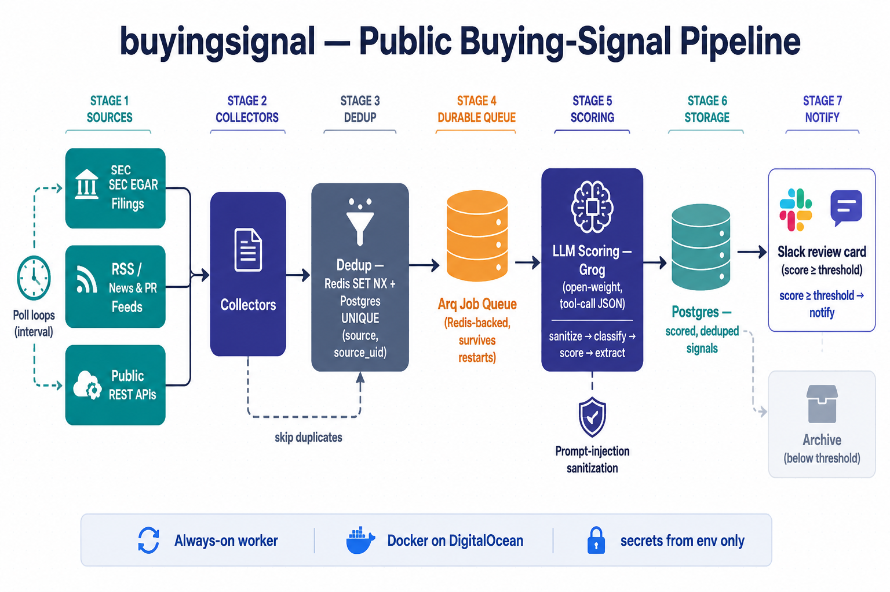

# buyingsignal

An always-on worker that watches **public** B2B buying signals (SEC EDGAR filings,
RSS/news/PR feeds, permitted public REST APIs), scores them with a low-cost
open-weight LLM through a serverless provider, dedupes and stores them in Postgres,
and posts above-threshold signals to Slack for human review.

> Sourcing is limited to public data and sources that permit automated access. No
> circumventing site protections, no violating third-party terms.

## Architecture



<sub>Diagram generated from the prompt in [`prompt.md`](prompt.md); save the output as `docs/workflow.png`.</sub>

<details>
<summary>Text version of the workflow</summary>

```
Arq cron / poll loops ─> Collectors ─> dedup (Redis NX + Postgres UNIQUE) ─> enqueue
   EDGAR / RSS / REST                                                          │
                                                                   durable Arq job
                                                                          │
                                          sanitize ─> Groq (tool-call JSON) ─> validate
                                                                          │
                                          persist ScoredSignal to Postgres
                                                                          │ score ≥ threshold
                                                                       Slack card
```

</details>

- **One process, two duties.** Scoring is a durable Arq (Redis-backed) job, so work
  survives restarts. Collection runs as event-loop poll loops on configurable
  intervals; a cron backstop re-enqueues any raw row whose scoring job was lost.
- **Dedup** is enforced at the DB by `UNIQUE(source, source_uid)` with
  `ON CONFLICT DO NOTHING`; a Redis `SET NX` seen-key short-circuits re-polls.
- **LLM provider is abstracted** behind an OpenAI-compatible client
  (`scoring/llm.py`). Groq is the default; switching to DeepInfra (e.g. a **Hermes**
  function-calling model), Together, or OpenRouter is configuration only — see below.

## Layout

| Path | Purpose |
|------|---------|
| `src/buyingsignal/config.py` | Settings + secrets (env only) |
| `src/buyingsignal/db/` | SQLAlchemy models, async engine, repo (dedup/upsert) |
| `src/buyingsignal/collectors/` | `base` (RawSignal + ingest), `rss`, `edgar`, `restapi` |
| `src/buyingsignal/scoring/` | `schema` (LLM contract), `prompts`, `llm`, `score` job |
| `src/buyingsignal/sink/slack.py` | Slack review card |
| `src/buyingsignal/security/sanitize.py` | Prompt-injection defense for external text |
| `src/buyingsignal/worker.py` | Arq `WorkerSettings`, poll loops, cron sweep |
| `src/buyingsignal/cli.py` | `run-once` / `score` for local verification |
| `alembic/` | Migrations |

## Quick start (local)

```bash
cp .env.example .env          # fill GROQ_API_KEY, SLACK_WEBHOOK_URL, feeds
# Bring up Redis + a dev Postgres:
docker compose --profile dev up -d redis postgres
# Apply schema (the `migrate` service is profiled, but `run` activates it directly):
docker compose run --rm migrate    # or, with deps installed locally: alembic upgrade head

# Run a single collector cycle against live sources (no worker needed):
python -m buyingsignal.cli run-once --collector rss
python -m buyingsignal.cli run-once --collector edgar

# Score a specific row by id (after a collector inserted it):
python -m buyingsignal.cli score --signal-id 1

# Or run the full standing worker (collectors + scoring + Slack):
arq buyingsignal.worker.WorkerSettings
```

### Verifying the loop
1. `run-once --collector rss` → new rows appear in `signals` with `status='raw'`.
2. With `GROQ_API_KEY` set, the worker (or `cli score`) advances rows to `scored`,
   filling `event_type` / `score` / `extracted`.
3. Re-run the collector → **no duplicate rows** (dedup).
4. A signal at or above `SCORE_THRESHOLD` posts a Slack card and moves to `notified`;
   below-threshold rows move to `archived`.
5. `docker compose restart app` → the worker resumes and queued scoring jobs are not
   lost (Redis AOF persistence).

## Switching LLM provider (e.g. to a Hermes model)

No code change. In the environment:

```bash
# DeepInfra hosting an open-weight Hermes function-calling model:
LLM_PROVIDER=openai-compatible
LLM_BASE_URL=https://api.deepinfra.com/v1/openai
LLM_API_KEY=<deepinfra-key>
LLM_MODEL=NousResearch/Hermes-3-Llama-3.1-70B
```

`scoring/llm.py` forces a `record_signal` tool call whose arguments must validate
against `ScoredSignal`; an invalid response triggers exactly one re-ask before the
job is failed (and retried by Arq).

## Configuration

All configuration — including every secret — is read from the environment only
(`config.py`). See `.env.example` for the full list. Key knobs:

- `RSS_FEEDS` — comma-separated feed URLs.
- `REST_SOURCES` — JSON array of declarative sources (no code to add one).
- `EDGAR_USER_AGENT` — **required** descriptive UA with contact info (SEC policy).
- `SCORE_THRESHOLD` — minimum relevance (0–100) to notify Slack.
- `*_INTERVAL_SECONDS` — per-collector poll cadence.

## Deploy (DigitalOcean droplet)

1. Create a single-purpose droplet; install Docker + Compose.
2. Place secrets in a root-owned file, never in the repo:
   ```bash
   sudo install -m 600 /dev/null /etc/buyingsignal/secrets.env
   sudo $EDITOR /etc/buyingsignal/secrets.env      # GROQ_API_KEY=..., DATABASE_URL=..., etc.
   ```
   Point the compose `app`/`migrate` `env_file` at it (or symlink to `.env`).
3. Use managed Postgres (Supabase / DO Managed PG) via `DATABASE_URL`; keep the
   `postgres` service for local dev only.
4. `docker compose run --rm migrate` then `docker compose up -d` (app + redis).
   `restart: unless-stopped` + Redis AOF give restart-survival.
5. **Harden the host:**
   - UFW: allow inbound SSH only; allow outbound 443 (providers/feeds) + your
     DB/Redis ports; deny other egress.
   - Container runs as a non-root user (`Dockerfile`); image bakes in no secrets.
   - `docker compose logs -f app` for observability (logs are JSON and
     secret-redacted by `logging.py`).

## Security posture

- Secrets: env-only, root-owned `secrets.env` (chmod 600), `.env` git-ignored,
  log redaction filter as a backstop.
- External text is sanitized (`security/sanitize.py`) and framed as inert data
  before any prompt — a prompt-injection mitigation, reinforced by the system prompt.
- Single-purpose service, non-root container, restricted egress.

## Tests

```bash
pip install -e ".[dev]"
pytest                  # offline: sanitize, schema, dedup, parsers, LLM client (mocked)
```

The live ON CONFLICT dedup and end-to-end flow are validated by the steps under
**Verifying the loop** against real Redis/Postgres.
